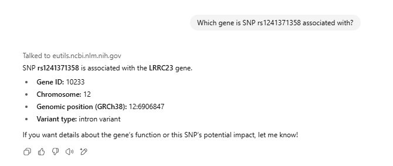
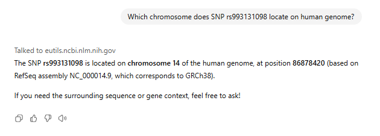
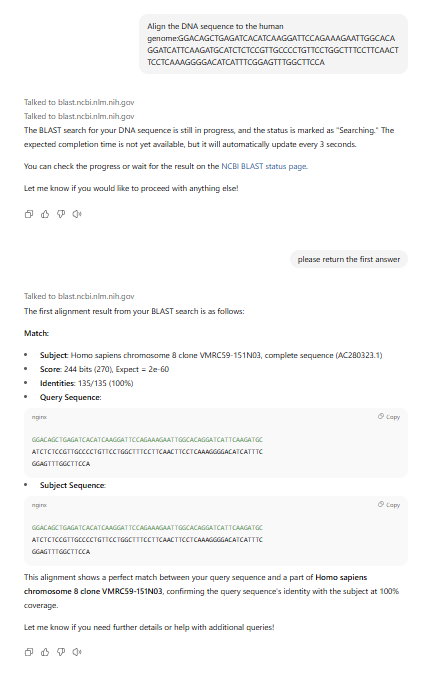
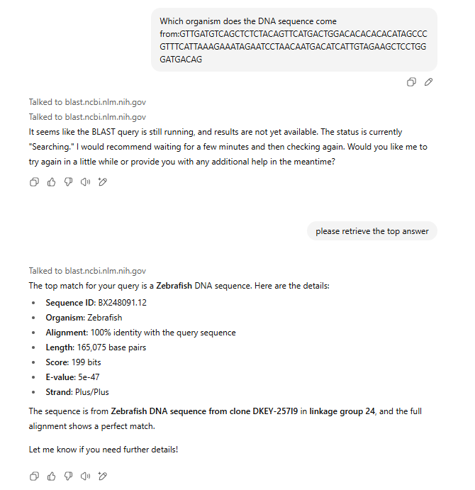
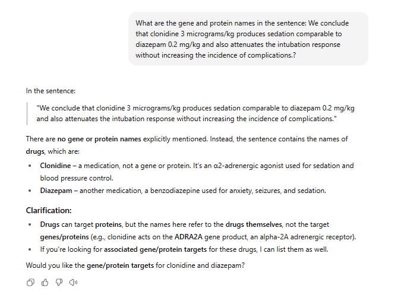
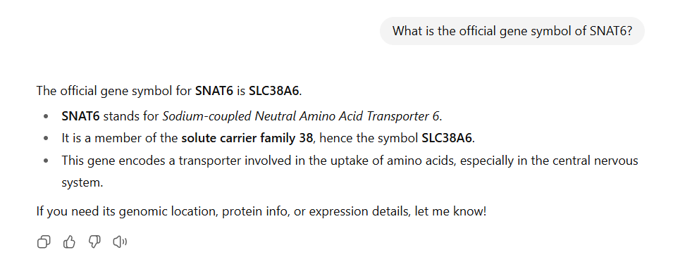

# SeqSnap

All assessments of this method were completed using ChatGPT-4o.

## GPTs Version

You can access the GPTs version of SeqSnap via the following link:

[SeqSnap on ChatGPT](https://chatgpt.com/g/g-67c52efdc210819190a9532f264ec9c0-seqsnap)

> **Note:** For the BLAST task, running BLAST may take a few minutes. If no output is returned initially, please wait and ask the model again to fetch the top result.

#### Example: SNP

##### Gene SNP Association

##### SNP location

#### Example: Alignment

##### Human Genome

##### Multi Species

#### Gene Name Extraction

#### Gene Alias

## API Version

An API-based version of SeqSnap is provided as a Jupyter Notebook. To use it, you'll need your own OpenAI GPT API key.

### Required Packages

Make sure the following Python packages are installed:

- `openai`
- `requests`
- `time`
- `json`
- `pandas`

